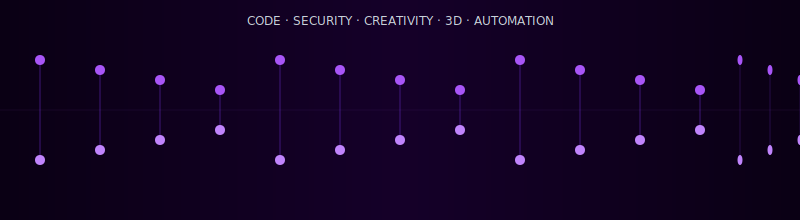
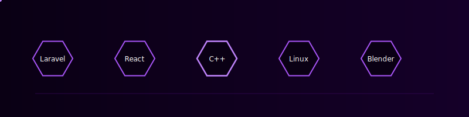
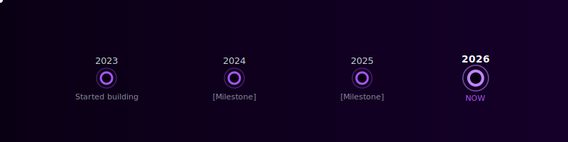
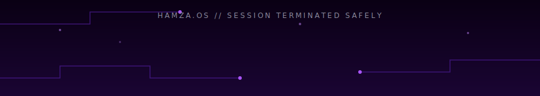

<div align="center">


<!-- ============================================================ -->
<!-- HEADER -->
<!-- ============================================================ -->


<br/>


</div>

<br/>

<!-- ============================================================ -->
<!-- VISITOR SCANNER -->
<!-- ============================================================ -->
<div align="center">

## ⬡ IDENTITY VERIFICATION



</div>

<br/>

<!-- ============================================================ -->
<!-- AI TERMINAL -->
<!-- ============================================================ -->
<div align="center">

## ⬡ AI TERMINAL



</div>

<br/>

<!-- ============================================================ -->
<!-- DIGITAL DNA / IDENTITY -->
<!-- ============================================================ -->
<div align="center">

## ⬡ DIGITAL DNA



</div>

```yaml
identity:
  callsign: Hamza Amir
  location: Karachi, Pakistan [PK]
  role: Full Stack Engineer / Security Researcher
  focus: [ Web Development, Application Security, 3D Graphics ]
  status: ONLINE
  clearance: DEVELOPER
  contact: hamzaamir72007@gmail.com
  portfolio: https://hamzaamir-portfolio.web.app
```

<br/>

<!-- ============================================================ -->
<!-- SKILL VISUALIZATION -->
<!-- ============================================================ -->
<div align="center">

## ⬡ NEURAL SKILL MATRIX



<br/><br/>



</div>

<details>
<summary align="center"><b>⬡ EXPAND SECONDARY MODULES (badges)</b></summary>

<br/>

<div align="center">

**Languages**


**Frontend**


**Backend & Data**


**Security & Tools**


**Design**


</div>

</details>

<br/>

<!-- ============================================================ -->
<!-- EXPERIENCE DASHBOARD -->
<!-- ============================================================ -->
<div align="center">

## ⬡ MISSION CONTROL

</div>

<table align="center">
<tr>
<td width="25%" align="center" valign="top">

**🎯 CURRENT MISSION**
<br/><br/>
`[Project name / focus]`
<br/>
`[One-line description]`

</td>
<td width="25%" align="center" valign="top">

**📡 LEARNING**
<br/><br/>
`Three.js`
<br/>
`Blender`
<br/>
`Advanced Pentesting`

</td>
<td width="25%" align="center" valign="top">

**🛰️ AVAILABILITY**
<br/><br/>
`OPEN TO COLLAB`
<br/>
`Web Dev Projects`

</td>
<td width="25%" align="center" valign="top">

**⚡ GOALS 2026**
<br/><br/>
`[Your goal here]`
<br/>
`[Your goal here]`

</td>
</tr>
</table>

<br/>

<!-- ============================================================ -->
<!-- TIMELINE -->
<!-- ============================================================ -->
<div align="center">

## ⬡ MISSION LOG



</div>

<br/>

<!-- ============================================================ -->
<!-- GITHUB STATS DASHBOARD -->
<!-- ============================================================ -->
<div align="center">

## ⬡ SYSTEM DIAGNOSTICS


</div>

<br/>

<!-- ============================================================ -->
<!-- PROJECTS -->
<!-- ============================================================ -->
<div align="center">

## ⬡ FEATURED DEPLOYMENTS

</div>

<table align="center" width="100%">
<tr>
<td width="50%" valign="top">

<div align="center">

**⬡ [PROJECT NAME]**
<br/>
`STATUS: LIVE`

`[One-line description of what this project does]`

`React` `Node.js` `MongoDB`

[`REPOSITORY`](https://github.com/x-hamza47) · [`LIVE DEMO`](https://your-link.com)

</div>

</td>
<td width="50%" valign="top">

<div align="center">

**⬡ [PROJECT NAME]**
<br/>
`STATUS: IN DEVELOPMENT`

`[One-line description of what this project does]`

`Laravel` `MySQL` `Tailwind`

[`REPOSITORY`](https://github.com/x-hamza47) · [`LIVE DEMO`](https://your-link.com)

</div>

</td>
</tr>
</table>

<div align="center">

<a href="https://github.com/x-hamza47/laravel-shop"></a>
<a href="https://github.com/x-hamza47/accessories"></a>

</div>

<br/>

<!-- ============================================================ -->
<!-- CONTRIBUTION SNAKE -->
<!-- ============================================================ -->
<div align="center">

## ⬡ ACTIVITY FEED


</div>

<br/>

<!-- ============================================================ -->
<!-- CONTACT -->
<!-- ============================================================ -->
<div align="center">

## ⬡ ESTABLISH CONNECTION

<a href="https://github.com/x-hamza47"></a>
<a href="https://discord.com/users/x_hamza47"></a>
<a href="mailto:hamzaamir72007@gmail.com"></a>
<br/>
<a href="http://www.instagram.com/x_hamza47"></a>
<a href="https://www.x.com/@_hamza47"></a>
<a href="https://www.threads.net/@x_hamzii47"></a>
<a href="https://hamzaamir-portfolio.web.app"></a>

</div>

<br/>

<!-- ============================================================ -->
<!-- FOOTER -->
<!-- ============================================================ -->


<div align="center">

`SYSTEM STANDBY // CONNECTION ENDED // THANK YOU FOR VISITING`

<br/>

<!-- LAST_SYNCED_START -->`SYSTEM LAST SYNCED: 2026-07-20 16:42 PKT`<!-- LAST_SYNCED_END -->

</div>
