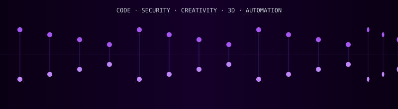
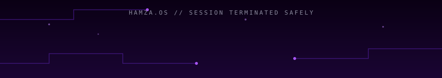

<div align="center">

<!-- ============================================================ -->
<!-- HEADER -->
<!-- ============================================================ -->


<br/>


</div>

<br/>

<!-- ============================================================ -->
<!-- VISITOR SCANNER -->
<!-- ============================================================ -->
<div align="center">

## ⬡ IDENTITY VERIFICATION


</div>

<br/>

<!-- ============================================================ -->
<!-- AI TERMINAL -->
<!-- ============================================================ -->
<div align="center">

## ⬡ DEVELOPER CONSOLE



</div>

<br/>

<!-- ============================================================ -->
<!-- DIGITAL DNA / IDENTITY -->
<!-- ============================================================ -->
<div align="center">

## ⬡ DIGITAL DNA



</div>

```yaml
identity:
  callsign: Hamza Amir
  location: Karachi, Pakistan [PK]
  role: Full Stack Engineer / Security Researcher
  focus: [ Web Development, Application Security, 3D Graphics ]
  status: ONLINE
  clearance: DEVELOPER
  contact: hamzaamir72007@gmail.com
  portfolio: https://hamzaamir-portfolio.web.app
```

<br/>
<!-- ============================================================ -->
<!-- CV DOWNLOAD -->
<!-- ============================================================ -->
<div align="center">
<a href="https://hamzaamir-portfolio.web.app/resume.pdf">
  
</a>

</div>
<br/>
<!-- ============================================================ -->
<!-- SKILL VISUALIZATION -->
<!-- ============================================================ -->
<div align="center">

## ⬡ NEURAL SKILL MATRIX



<br/><br/>
##
</div>

<details>
<summary align="center"><b>⬡ SOFTWARE INVENTORY</b></summary>

<br/>

<div align="center">


</div>

</details>
<br/>


<!-- ============================================================ -->
<!-- GITHUB STATS DASHBOARD -->
<!-- ============================================================ -->
<div align="center">

## ⬡ SYSTEM DIAGNOSTICS


</div>

</div>

<br/>

<!-- ============================================================ -->
<!-- PROJECTS -->
<!-- ============================================================ -->
<div align="center">

## ⬡ FEATURED DEPLOYMENTS

</div>

<table align="center" width="100%">
<tr>
<td width="50%" valign="top">

<div align="center">

**⬡ TIC TAC TOE**

<br/>

`STATUS: LIVE`

`A polished browser-based Tic-Tac-Toe game with a responsive interface and smooth gameplay experience.`

`Html` `CSS` `JS`

[`REPOSITORY`](https://github.com/x-hamza47/tic-tac-toe) · [`LIVE DEMO`](https://tic-tac-toe-three-mu-94.vercel.app)

</div>

</td>

<td width="50%" valign="top">

<div align="center">

**⬡ VACCINATION MANAGEMENT SYSTEM**

<br/>

`STATUS: COMPLETED`

`A full-stack platform that streamlines vaccination records, appointments, and healthcare administration.`

`Laravel` `MySQL` `Tailwind CSS`

[`REPOSITORY`](https://github.com/x-hamza47) · `LIVE DEMO: PRIVATE`

</div>

</td>

</tr>
</table>

<div align="center">

<a href="https://github.com/x-hamza47/laravel-shop"></a>
<a href="https://github.com/x-hamza47/accessories"></a>

</div>

<br/>

<!-- ============================================================ -->
<!-- CONTRIBUTION SNAKE -->
<!-- ============================================================ -->
<div align="center">

## ⬡ ACTIVITY FEED


<br/>


</div>

<br/>

<!-- ============================================================ -->
<!-- CONTACT -->
<!-- ============================================================ -->
<div align="center">

## ⬡ ESTABLISH CONNECTION

<a href="https://github.com/x-hamza47"></a>
<a href="https://discord.com/users/x_hamza47"></a>
<a href="mailto:hamzaamir72007@gmail.com"></a>
<br/>
<a href="http://www.instagram.com/x_hamza47"></a>
<a href="https://www.x.com/@_hamza47"></a>
<a href="https://www.threads.net/@x_hamzii47"></a>
<a href="https://hamzaamir-portfolio.web.app"></a>
[](https://hamzaamir-portfolio.web.app/resume.pdf)

</div>

<br/>

<!-- ============================================================ -->
<!-- FOOTER -->
<!-- ============================================================ -->



</div>
